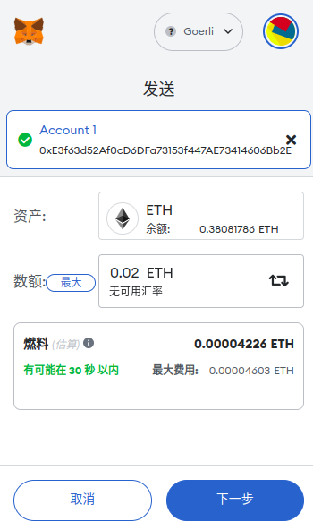
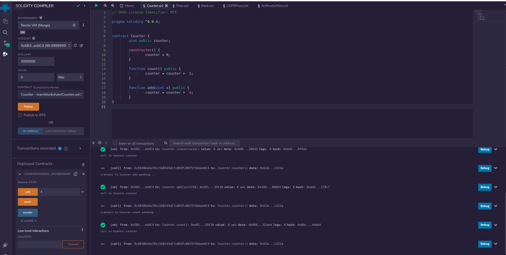
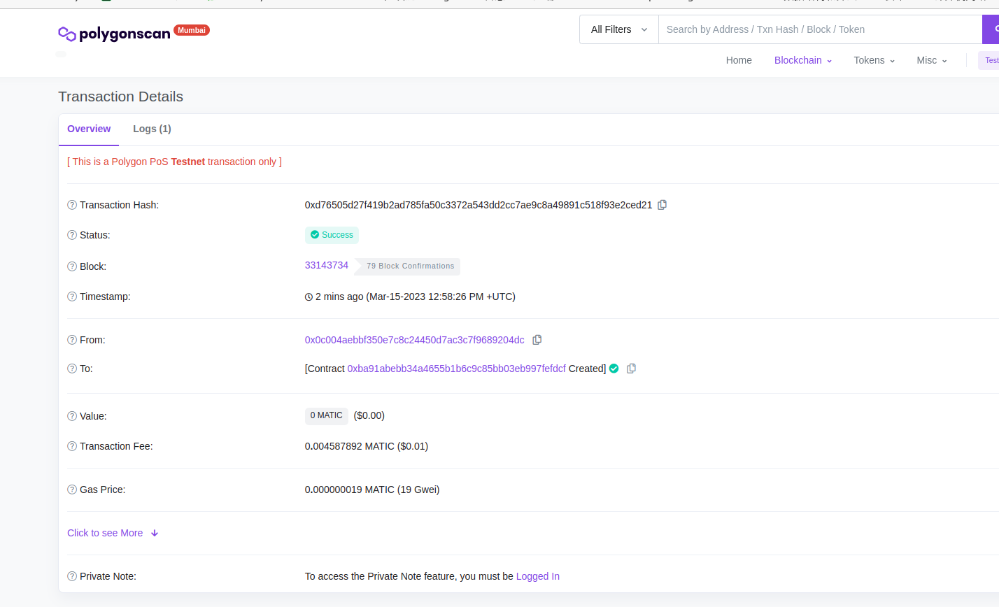

### 登链社区区块链技术集训营第二期作业

#### 第一周

##### w1_1 理解区块链及智能合约开发

- 使用 Metamask	执行一次[转账](https://goerli.etherscan.io/tx/0xb2f07a31ae2ed3311c5c61480f684113595357abe3b8b399d522b9e6029c89d2)

	

- 使用 Remix 创建一个 Counter 合约并部署

	

##### w1_2 Hardhat 开发工具使用

- 代码开源到[区块链浏览器](https://mumbai.polygonscan.com/address/0xBA91ABEbb34a4655B1B6c9c85BB03eb997FEfDcF#code)

    
